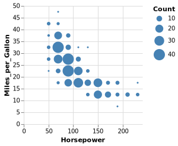

# Jupyter Widget
The `VegaFusionWidget` is a Jupyter widget for rendering Vega specs backed by VegaFusion. It is based on [AnyWidget](https://github.com/manzt/anywidget), and is compatible with a wide range of Jupyter-based environments.

:::{note}
The `VegaFusionWidget` is only compatible with Vega specifications, not with Vega-Lite. For Vega-Lite, either use the [JupyterChart](https://altair-viz.github.io/user_guide/jupyter_chart.html) widget from the Vega-Altair project, or convert the Vega-Lite spec to Vega using [vl-convert](https://github.com/vega/vl-convert).
:::

## Construction
Construct a VegaFusionWidget from a Vega specification dictionary:

```python
import vegafusion as vf
import json
from vegafusion.jupyter import VegaFusionWidget

vega_spec = json.loads(r"""
{
  "$schema": "https://vega.github.io/schema/vega/v5.json",
  "description": "A binned scatter plot example showing aggregate counts per binned cell.",
  "width": 200,
  "height": 200,
  "padding": 5,
  "autosize": "pad",

  "data": [
    {
      "name": "source",
      "url": "data/cars.json",
      "transform": [
        {
          "type": "filter",
          "expr": "datum['Horsepower'] != null && datum['Miles_per_Gallon'] != null && datum['Acceleration'] != null"
        }
      ]
    },
    {
      "name": "summary",
      "source": "source",
      "transform": [
        {
          "type": "extent", "field": "Horsepower",
          "signal": "hp_extent"
        },
        {
          "type": "bin", "field": "Horsepower", "maxbins": 10,
          "extent": {"signal": "hp_extent"},
          "as": ["hp0", "hp1"]
        },
        {
          "type": "extent", "field": "Miles_per_Gallon",
          "signal": "mpg_extent"
        },
        {
          "type": "bin", "field": "Miles_per_Gallon", "maxbins": 10,
          "extent": {"signal": "mpg_extent"},
          "as": ["mpg0", "mpg1"]
        },
        {
          "type": "aggregate",
          "groupby": ["hp0", "hp1", "mpg0", "mpg1"]
        }
      ]
    }
  ],

  "scales": [
    {
      "name": "x",
      "type": "linear",
      "round": true,
      "nice": true,
      "zero": true,
      "domain": {"data": "source", "field": "Horsepower"},
      "range": "width"
    },
    {
      "name": "y",
      "type": "linear",
      "round": true,
      "nice": true,
      "zero": true,
      "domain": {"data": "source", "field": "Miles_per_Gallon"},
      "range": "height"
    },
    {
      "name": "size",
      "type": "linear",
      "zero": true,
      "domain": {"data": "summary", "field": "count"},
      "range": [0,360]
    }
  ],

  "axes": [
    {
      "scale": "x",
      "grid": true,
      "domain": false,
      "orient": "bottom",
      "tickCount": 5,
      "title": "Horsepower"
    },
    {
      "scale": "y",
      "grid": true,
      "domain": false,
      "orient": "left",
      "titlePadding": 5,
      "title": "Miles_per_Gallon"
    }
  ],

  "legends": [
    {
      "size": "size",
      "title": "Count",
      "format": "s",
      "symbolFillColor": "#4682b4",
      "symbolStrokeColor": "transparent",
      "symbolType": "circle"
    }
  ],

  "marks": [
    {
      "name": "marks",
      "type": "symbol",
      "from": {"data": "summary"},
      "encode": {
        "update": {
          "x": {"scale": "x", "signal": "(datum.hp0 + datum.hp1) / 2"},
          "y": {"scale": "y", "signal": "(datum.mpg0 + datum.mpg1) / 2"},
          "size": {"scale": "size", "field": "count"},
          "shape": {"value": "circle"},
          "fill": {"value": "#4682b4"}
        }
      }
    }
  ]
}
""")
VegaFusionWidget(vega_spec)
```




## Debouncing
The `VegaFusionWidget` provides configurable [debouncing](https://css-tricks.com/debouncing-throttling-explained-examples/) to control how frequently user interaction updates are sent from the browser to the Python kernel.  

The widget's `debounce_wait` and `debounce_max_wait` properties correspond to the `wait` and `max_wait` properties of the [lodash debounce](https://lodash.com/docs/#debounce) function. VegaFusion uses sensible defaults (`debounce_wait` of 30ms and `debounce_max_wait` of 60ms), but it can be useful to increase the default values to handle interactions on large datasets.

## Planner Results
The `VegaFusionWidget` also supports displaying the results of the planner. See [How it Works](../about/how_it_works.md) for more details.

The following properties are available:

 - `widget.spec`: This is the original Vega specification
 - `widget.transformed_spec`: This is the initial transformed Vega specification produced by VegaFusion
 - `widget.server_spec`: This is the portion of the full Vega spec that was planned to run on the server (The Python kernel in this case)
 - `widget.client_spec`: This is the portion of the full Vega spec that was planned to run on the client and be rendered by the Vega JavaScript Library.
 - `widget.comm_plan`: This is the specification of which signals and datasets must be transfered between the client and server in order to preserve the interactive behavior of the original specification.
