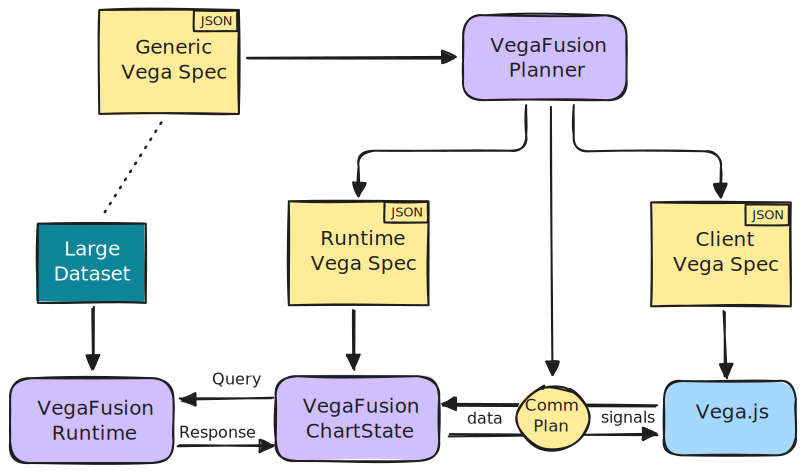

```{raw} html
<div
    style="margin-left:-16px;margin-bottom:-12px"
>
    
    
</div>
<h4>Building blocks for analyzing, accelerating, and scaling Vega visualizations</h4>
```

# Purpose

The VegaFusion project provides Rust, Python, and JavaScript libraries for analyzing, accelerating, and scaling [Vega](https://vega.github.io/vega/) visualizations. The goal is to provide low-level building blocks that higher level Vega systems (such as [Vega-Altair](https://altair-viz.github.io/) in Python) can integrate with.

:::{note}
If you've arrived here looking for information on how to scale Vega-Altair visualizations to support larger datasets, see the Vega-Altair documentation on the [`"vegafusion"` data transformer](https://altair-viz.github.io/user_guide/large_datasets.html#vegafusion-data-transformer).
:::

# Architecture
See [How it works](about/how_it_works.md) for more details on the VegaFusion architecture.

```{raw} html
<div
    style="margin:30px 40px 50px 40px;text-align:center"
>
    
    
</div>
```

# Python Installation

The VegaFusion Python package can be installed into a Python environment using pip

```bash
pip install vegafusion
```

or conda

```bash
conda install -c conda-forge vegafusion
```

```{toctree}
:maxdepth: 1
:hidden: true

features/features
Vega Coverage <vega_coverage/optimized_transforms>
About <about/background>
Community <community/governance>
Blog <posts/posts>
```
